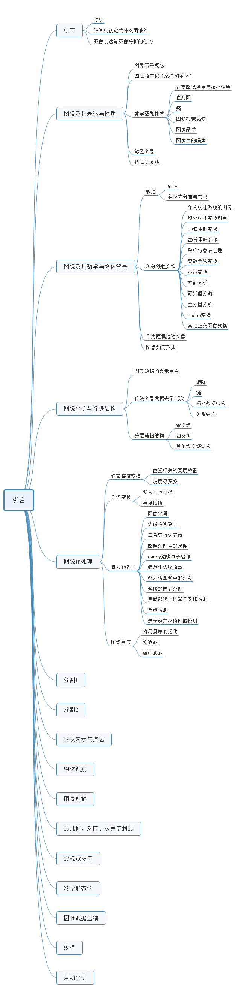

#### 学习《图像处理、分析与机器视觉》的必要性

1、我现在学的是AI图像方面的知识，就是用AI的工具和方法去处理一些图像，得到我们想要的结果或者决策。但其中，AI主要是工具，更重要的还是对图像领域的理解和认识。现在很多处理图像的深度学习方法，例如卷积神经网络跟传统的卷积其实差不多。**所以，我们很有必要把传统的一些图像处理的办法给深入学习一下。**

2、**主要是对图像领域的进一步加深理解**，并且融合为自己理解图像的一个思维习惯，尝试多个角度去理解图像算法，**那么我们遇到某些问题，或者某些算法不work的时候，我们可以从多个角度分析为什么？然后解决实际问题的时候，我们可以迸发出很多解决问题的idea。**

3、平时的积累在于关键时刻解决问题的效率，你能提出很多解决问题的角度和方案，快速解决问题

4、AI图像，基础在于图像。对于图像来说，基础基本是不会变化的，那么你认认真真啃下一本书，其他的书都是类似的，对你来说性价比是最高的。从某个角度来说，基础是通用的，啃下来，看很多其他的书就很快。很多最新的AI图像算法理解起来也很轻松，甚至你能提出一些新的解决方法和观点。

5、AI图像是我一辈子要奋斗的事业，学生时期花很多时间啃基础知识。一步一个脚印，扎扎实实地学习，对于后期的职业发展大有好处，并且上限也会很高。

6、基础是根本，没有基础，一切都是构建在空中楼阁的大厦，出点什么问题，自己根本不知道怎么分析，更不用说去解决。

#### 怎么学习《图像处理、分析与机器视觉》

1、列个大纲，了解图像处理涉及的领域和问题

2、**有侧重点地学习，对于一些重要的知识和方法，要花大量的时间研究透，并且做笔记**。对于一些没那么重要的，简单了解即可。

3、最重要的不是去记忆，而是理解图像领域涉及的大致知识和算法，更进一步深入地理解图像。

4、去掌握知识，然后解决问题，而不是单纯地学习。

5、掌握知识的重点在于，你理解透这个东西，它成为你思考问题的一个角度。所以我们学习的时候，也要想想这些算法的思考角度是什么，它能解决什么问题，为什么？熟稔于心

**抓住重点，做记录，不是重点的东西，不要记录。**

6、项目应用的方式，我会结合opencv做更多的编程训练，理论与动手结合，才能掌握得更加牢靠。

**7、每一章学习都要做记录，但是只是记录重点，冗余的东西要去掉。记录重点、记录可以用来解决什么样样的问题，它的算法是基于图像领域的那个角度或者方向**

8、实际学东西的时候，不要急功近利，要只顾眼前光。在这个时间段内，做好当下的一点事情就行，其他一概不理。

**9、我希望我学习的时候，不是抱着完成某个任务，而是享受去算法处理的一个有效性和便捷性，去享受和感受这些顶级科学家提出的算法解决问题的角度，沉浸在其中。**

10、多思考算法的原理，解决什么问题，可以用来解决哪些类似的问题。

11、基础性的东西一定要先去学习，例如第一章到第五章涉及到图像领域的研究方向、图像的表示和性质、图像的数学背景、图像分析的数据结构和图像预处理。这些对于图像领域不同的方向来说（例如分割、识别），这些是共同的基础，需要深入掌握。

12、对于一些不同图像方向的知识，我们有选择性地进行学习。例如，我现在做的是目标识别和分类，那么，我除了看前五章的知识，还要第九章、第十章和第十三章的内容，其他的可以先不看。当我学习其他领域的时候，可以看看其他领域的章节，不用一下子全部去看。

#### 《图像处理、分析和机器视觉》的大纲

