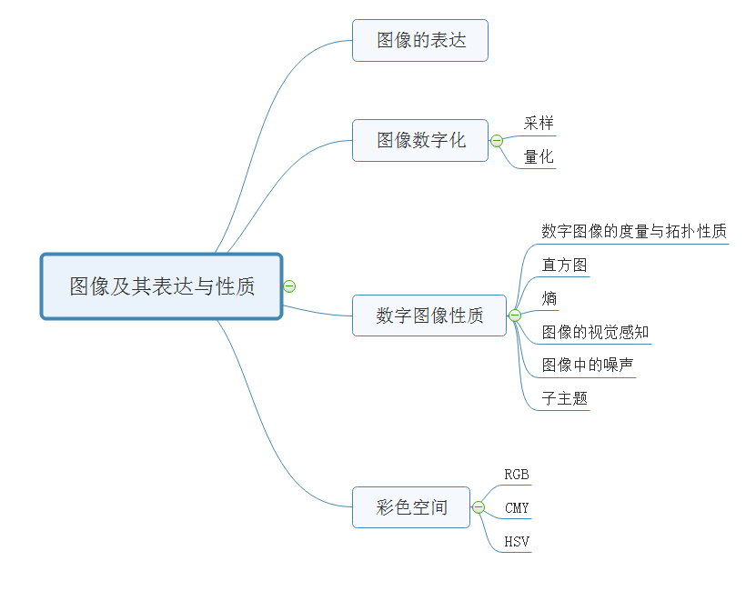
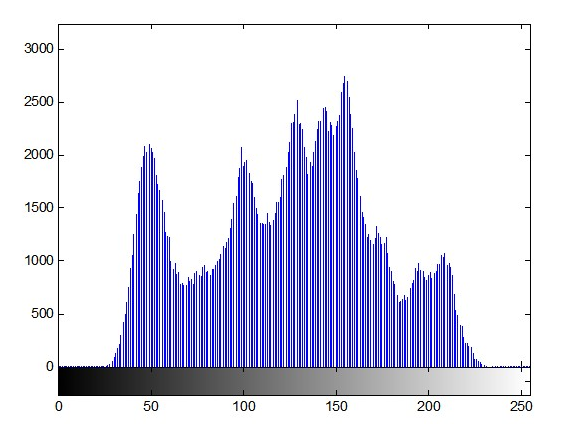
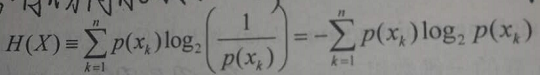
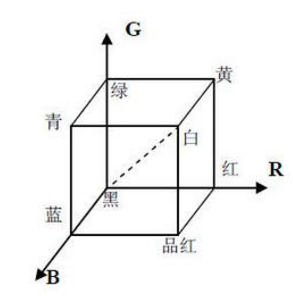
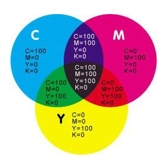
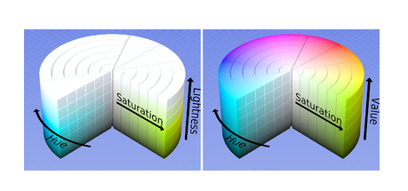

#### 一、第二章的内容大纲（思维导图）

#### 二、概念讲解

1、图像的表达

​	人们视网膜上的图像或者是摄像机捕捉的图像，可以表示为两个变量的连续函数f(x,y)，其中x，y表示像素点的坐标，函数值表示亮度。或者也可以加多一个时间的维度进行表示f(x,y,t)一个时间序列的图像，可以是一组连续的动图，或者是一个视频。

​	图像可以进一步表示为灰度图和彩色图，灰度图只有一个通道来表示像素点的亮度，彩色图则从RGB三个通道表示像素点在不同彩色通道的亮度。**对于灰度图来说，最低的亮度值表示黑色，最高的亮度值表示白色，其他的亮度值是灰色，介于黑白之间**。

2、图像数字化

​	为了方便计算机理解，我们必须把采集的连续图像函数f(x,y)进行离散化，这就是图像数字化。具体来说，图像数字化把f(x,y)采样为一个M行N列的矩阵，然后把每个像素点的亮度值表示为一个整数值K，就是把最低的亮度值到最高亮度值划分为K个区间，在每个区间内部的亮度值用相应的区间整数值进行表示。K越大的话，量化的越精细，越接近原图像。

（1）采样

（2）量化

​	把图像的亮度量化为一个整数值，这个整数值范围为0-K，其中K由我们使用的图像位数进行表示。例如，我们8bit来表示亮度值，那么K就是256，亮度值就是0到256。

​	当讲话级别不够的时候，图像会出现伪轮廓的情况。主要是亮度的级别数低于人们能够轻易分辨出来的量级，很多轮廓会失真。

3、数字图像性质

（1）数字图像的度量和拓扑性质

​	距离、四邻接、八邻接、联通

​	边缘是一个比较重要的概念，表示像素和直接领域的局部特征，是一个具有大小和反向的矢量。大小就是图像函数的梯度，方向与梯度方向垂直，后面的章节会详细介绍边缘特征。

（2）直方图

​	直方图表示图像亮度值z出现的频率。一个有L灰阶的图像的直方图由长度为L的数组进行表示。

​	直方图是图像与概率描述建立的一个很自然的桥梁，也是图像中唯一的全局信息。

（3）熵

​	直方图表示概率密度p，我们可以用熵H来估计图像的信息量大小，在信息学上可以称之为信息熵。具体的表达公式是

其中，X表示随机变量（灰度值），每个小的x表示灰度值的某个数值，例如0到256。

​	在实际应用过程中，为了压缩图像，我们可以用熵来表示一个图像中的冗余性。

（4）对比度

​	物体亮度的平均值与背景亮度的比值

（5）图像锐化

​	图像锐化*(image sharpening)*是补偿图像的轮廓，增强图像的边缘及灰度跳变的部分，使图像变得清晰，分为空间域处理和频域处理两类。图像锐化是为了突出图像上地物的边缘、轮廓，或某些线性目标要素的特征。这种滤波方法提高了地物边缘与周围像元之间的反差，因此也被称为边缘增强。

（6）图像噪声

​	在图像获取、传输和图像处理的过程中，可能会导致图像的失真，图像的失真的部分就称之为噪声。

​	噪声一般有概率特征来刻画，理想的噪声是白噪声，就是在所有频率上面的强度都相同的噪声。比较常见的噪声是高斯噪声，高斯噪声的概率分布符合高斯分布。

​	信噪比：图像所有像素值的平方和除以图像所有噪声的平方和，信噪比越大，表示图像的质量越高，失真越小。

4、彩色空间

（1）RGB

​	RGB颜色空间就是由红绿蓝三种颜色合成表示所有颜色的颜色空间。

（2）CMY

​	CMY与RGB类似，是由青色、品红、黄色三种颜色组合而成的颜色空间，常用于印刷行业。

（3）HSV

​	HSV空间是有色调、饱和度和亮度组成的空间。HSV把亮度从彩色中分离出来，而色调与饱和度与人类的感知相对于，常常用于实际的开发算法中。在实际的处理工程中，物体经常受到光照等环境的影响，在rgb空间下处理的时候，结果变化非常大。所以，我们经常转化到hsv空间，再对图像进行处理，减少环境对图像带来的影响。

